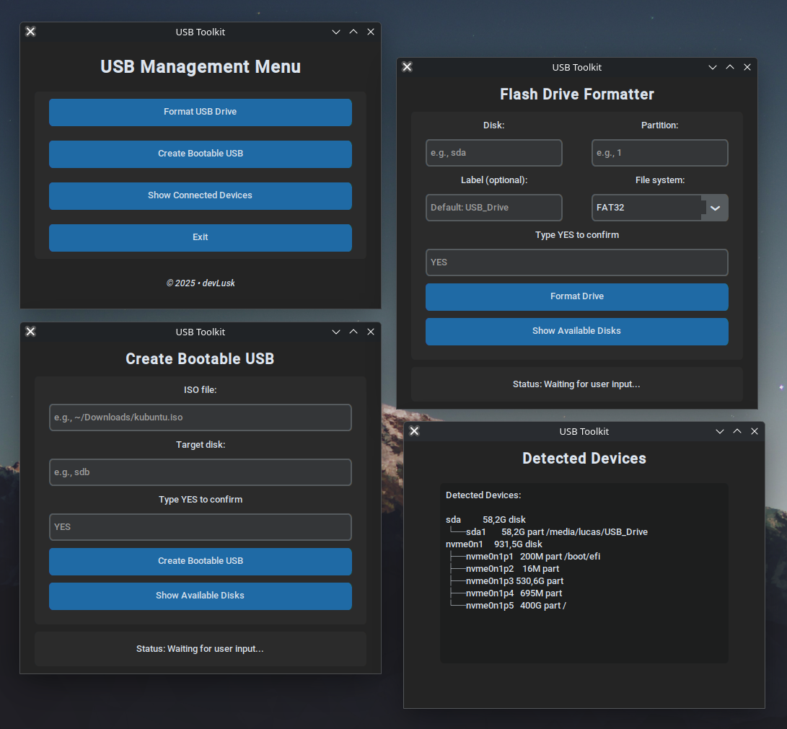

# USB Formatter & Bootable USB Creator



A Linux desktop application written in **Python** using **CustomTkinter** that allows you to safely **format USB flash drives** and **create bootable USB devices from ISO files**.

This tool is intended for **local desktop use** and performs low-level disk operations, therefore **administrator privileges are required**.

---

## ✨ Features

* **Graphical Interface (GUI)** built with CustomTkinter
* **Automatic device detection** using `lsblk`
* **Format USB drives** with the following file systems:

  * FAT32 (maximum compatibility)
  * NTFS (Windows-friendly)
  * EXT4 (Linux-native)
* **Custom volume label** support
* **Create bootable USB drives** from ISO images using `dd`
* **Safety confirmations** before destructive operations

---

## ⚠️ Important Warning

This application can **permanently erase data** on storage devices.

* Always double-check the selected device
* Never select your system disk
* You are fully responsible for any data loss

---

## 🖥️ Requirements

### Operating System

* Linux (Debian/Ubuntu-based distributions recommended)

### System Packages

The following packages are required and will be installed automatically by the setup script:

* `python3`
* `python3-venv`
* `python3-tk`
* `parted`
* `lsblk`
* `wipefs`
* `dosfstools`
* `ntfs-3g`
* `e2fsprogs`

### Python

* Python **3.8+**

---

## 📦 Installation

### 1️⃣ Clone the repository

```bash
git clone https://github.com/devLusk/flashdrive-tool.git
cd flashdrive-tool
```

### 2️⃣ Make the launcher executable

```bash
chmod +x run.sh
```

That’s it — no manual dependency installation required.

---

## ▶️ Usage

Run the application using:

```bash
./run.sh
```

What the script does:

1. Explains what will be installed and executed
2. Requests user confirmation
3. Requests administrator (sudo) privileges
4. Installs required system packages (if missing)
5. Creates a Python virtual environment (`venv`)
6. Installs Python dependencies from `requirements.txt`
7. Launches the graphical application

---

## 🧭 Application Overview

From the GUI you can:

### 🔹 Format USB Drive

* Select a removable device
* Choose a file system (FAT32 / NTFS / EXT4)
* Set a volume label
* Confirm before formatting

### 🔹 Create Bootable USB

* Select an ISO image
* Choose a target USB device
* Write the ISO using `dd`
* Confirmation required before writing

---

## 🛡️ Safety Measures

* Explicit confirmation dialogs before destructive actions
* Device listing shows full paths (e.g. `/dev/sdb`)
* Designed to avoid accidental system disk selection

---

## ❌ Limitations

* Linux only
* Requires administrator privileges
* No support for Windows or macOS
* Uses `dd` for ISO writing

---

## 🤝 Contributing

Contributions are welcome!

You can help by:

* Improving safety checks
* Adding progress indicators
* Enhancing UI/UX
* Improving device detection

Feel free to open issues or submit pull requests.

---

## 📄 License

This project is provided as-is for educational and personal use.
Use at your own risk.